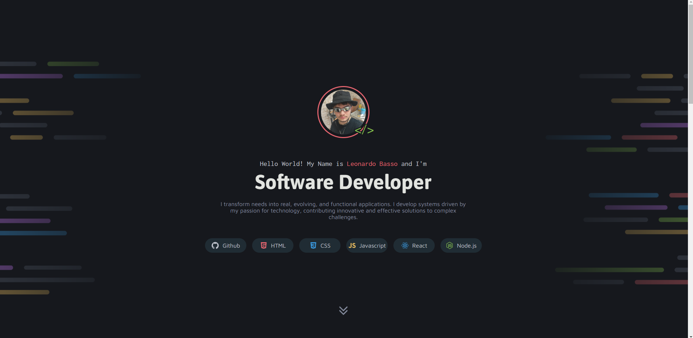
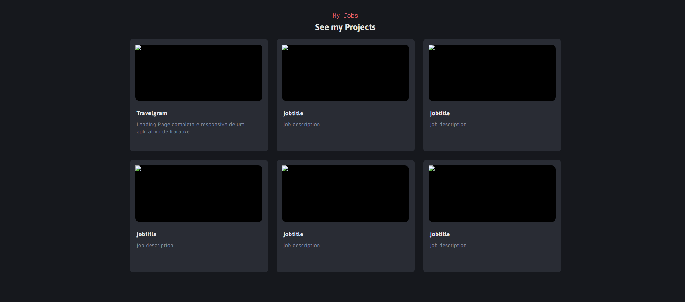

# Simple Portfolio

**Simple Portfolio** is a project created using **HTML**, **CSS**, and **JavaScript**. The goal of this portfolio is to provide a platform to showcase my projects in an organized and visually appealing way. While the portfolio structure is complete, I have not yet added the projects I have worked on.

## Features
- **Clean Design**: A simple and user-friendly interface.
- **Responsive Layout**: Optimized for both desktop and mobile devices.
- **Dynamic Elements**: Includes basic interactivity using JavaScript.
- **Ready for Projects**: The structure is set up to easily add and display projects.

## Technologies Used
- **HTML**: For structuring the content.
- **CSS**: For styling and layout.
- **JavaScript**: For adding interactivity.

## Screenshots

### Portfolio Home Page

### Project Section

## Project Status
The portfolio is currently **ready** to host projects, but the project section is empty as I am still in the process of curating and uploading my work.

## Next Steps
- Add descriptions and links to completed projects.
- Enhance interactivity with more advanced JavaScript features.
- Continue improving the design for a more professional appearance.

## Contribution
Feedback and suggestions are welcome! Feel free to share your thoughts to help improve this portfolio.

## License
This project is open-source and available under the MIT License.
